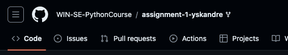
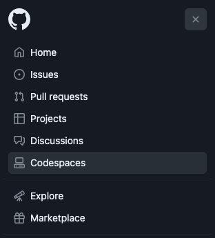
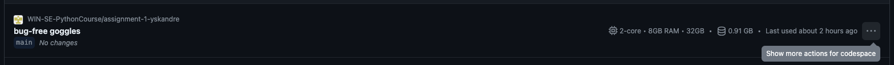
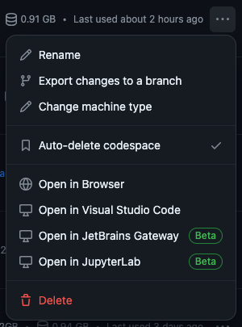
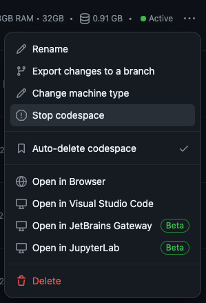
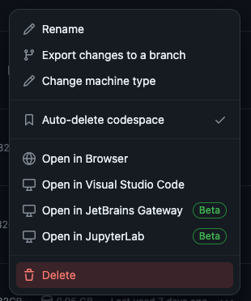

# Too many codespaces open

If you get an error message about having too many running codespaces, you need to stop or delete some of them.

To do that, navigate to [this page](https://github.com/codespaces). To get to this page through the github website, click the three lines in the top left and then select codespaces from the dropdown.

On the codespaces page, you are presented with a list of all your codespaces.

To stop or delete a codespace, click on the three dots to the right of a codespace listing.

This opens a context menu, in which you can chose to stop the codespace, if its running, or delete it.

# DO NOT DELETE A CODESPACE IF YOU HAVE NOT SUBMITTED YOUR CHANGES. YOUR CHANGES WILL BE DELETED.

