## How to open python files

Click on the green '<> Code' icon

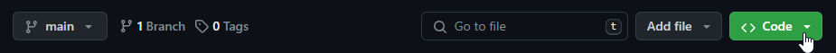

There, select the 'Codespaces' tab

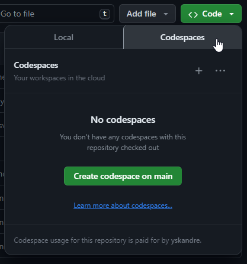

Click the green 'Create Codespace on main' button. 

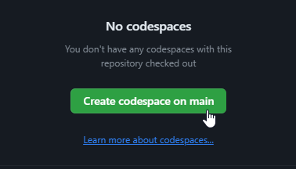

Creating a codespace is included in your free account.

A new tab should open with the codespace environment.

If you already made a codespace before, you can find it in the tab and open it from there:

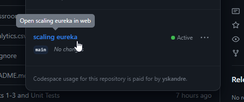

## How to execute python code

When starting the codespace, you will see three panels: The explorer to the left, showing the files of the assignments, the console in the bottom, showing code outputs, and the task description in the top, detailing what you have to do in the assignment:

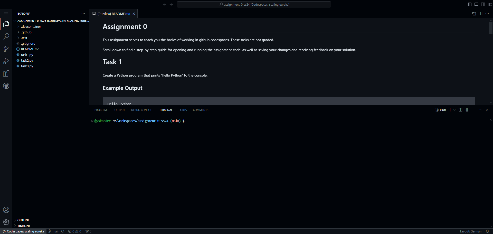

To open a file, navigate to the file list in the explorer and right-click the desired python file (.py). From the context menu, select 'Open to the Side

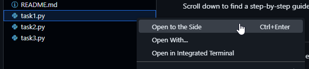 

The file will open on the right, next to the task description. 

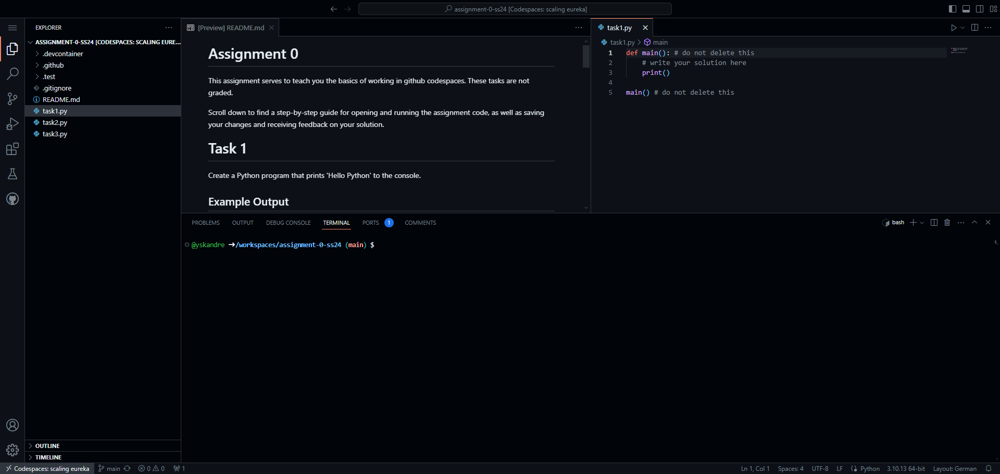 

Click the run arrow (>) in the top right to execute the code in the cell.

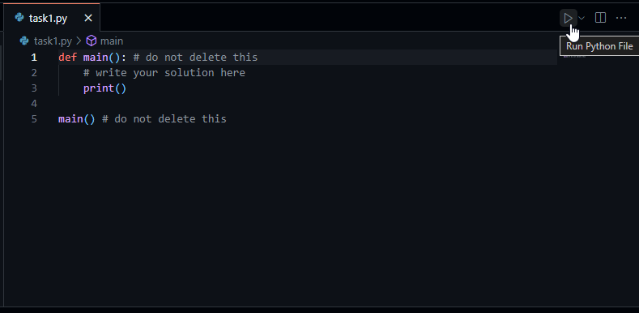 

The file will be executed and the output will be printed to the console.

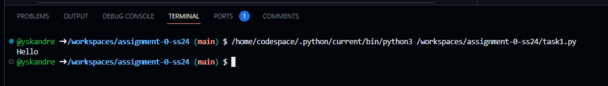

If there are console inputs in the cell, you can type inputs in the console in the bottom half of the editor.

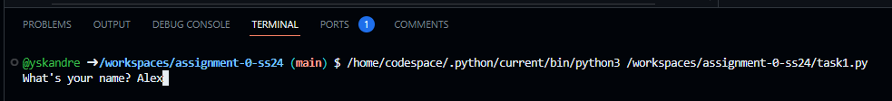

## Committing and Pushing your changes

After developing a solution, you can trigger a test run by submitting your changes. You have to submit your changes or we cannot see them, which means we can only give you points if you submitted your solution. You can and should submit your code multiple times, to both save your progress for grading and get test feedback on what you have implemented. When you are done with the assignment you should **always** submit your code one last time. 

To do this, navigate to the third icon in the toolbar to the left, in the explorer. 

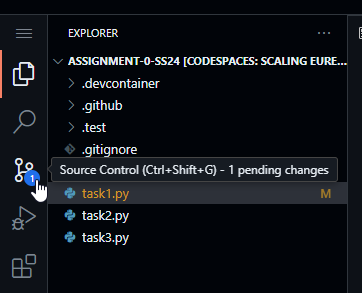

Your changes will be listed in the new explorer tab. Click the big 'Commit' button to begin selecting all your changes.

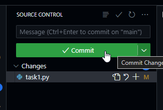

This will be followed by a popup, asking you if you want to submit all your changes. Select either 'Yes', or 'Always', to skip it in the future.

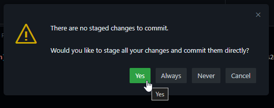

After this, a new tab will openn in the right-most panel, where you edited your code, or in the task description. In this tab, you need to enter a 'commit message'.

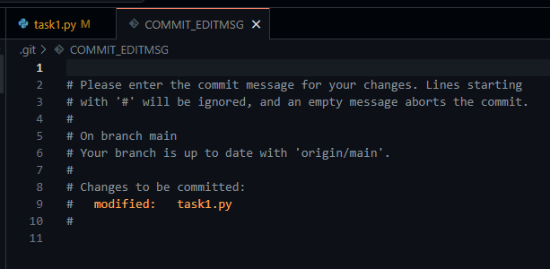

This message serves to inform others, or you in the future, what you did in the changes you submitted. You can however write anything as your message and it will work.
After writing a message, click the tick icon in the top right of the panel to confirm your message

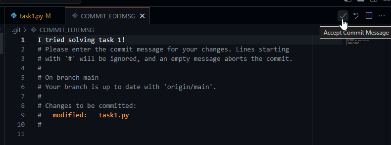

Now our changes are ready to submit, or 'sync' with the data stored on the web, we can click the 'Sync Changes' button

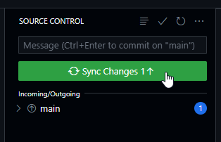

This once again is followed by a popup. Select either 'OK', or 'OK, Don't Show Again', to skip it in the future.

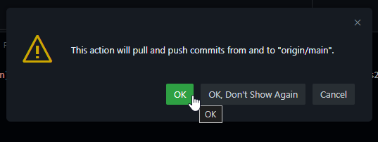

Congratulations, you have successfully submitted your changes and started a test run.
To check your test results, you have multiple options.
In the repository page, you can click on the latest update (which you just did) to show a summary of the changes.

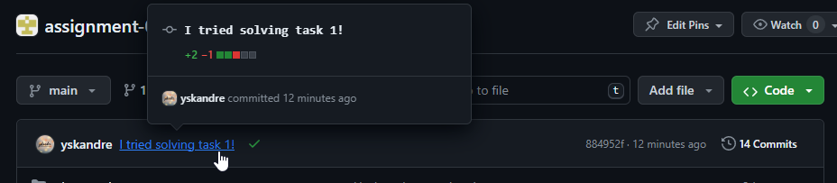

The test results have been posted there as a message.

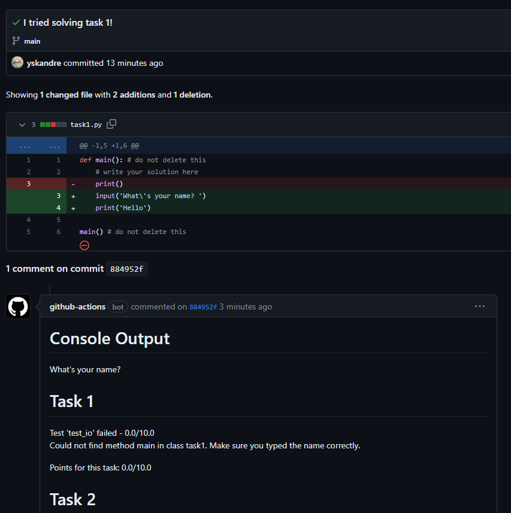

The test results can also be directly sent to your email inbox, if you are subscribed to the message thread.
To disable this, click on the icon at the bottom of your change summary.

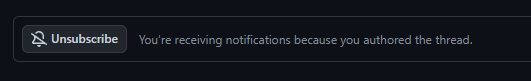

To turn off notification in general, you can disable them in your account settings under the notifications tab.

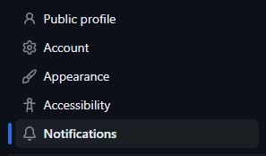
