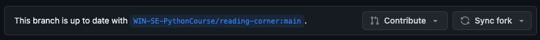
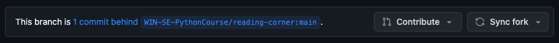
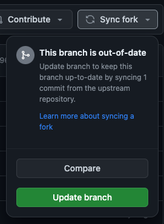
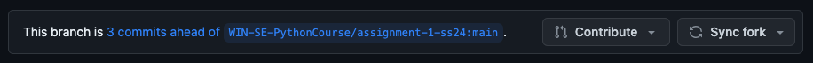
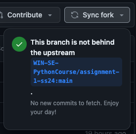

## How to get new files

We may add or modify test files if we discover errors. To add them to your assignment repository, you need to sync changes.

If no updates are available, the top of your repository view will look like this:

If there are any updates available the top of your repository view will look like this:

To receive the changes, click on 'Sync fork' and afterwards click on the green 'Update branch' button.

The page will reload and the changed files are updated.

If you already submitted changes yourself, the top of your repository view may look like this:

Clicking 'Sync fork' will display the following, as there are no updates for you to receive:

