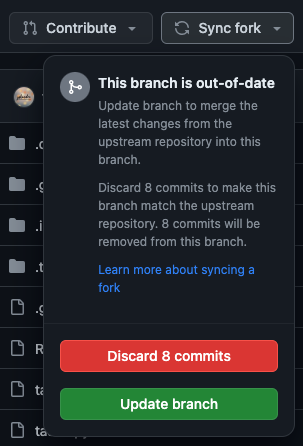

## How to get new files

We may add or modify test files if we discover errors. To add them to your assignment repository, you need to sync changes.

If no updates are available, the top of your repository view will look like this:

If there are any updates available the top of your repository view will look like this:

Before loading any changes, make sure that your codespace is submitted. To ensure everything works after the changes have been loaded, you should delete your codespace and create a new one after the update. Check [Submit your solution](codespace_use.md#submit-your-solution).

To receive the changes, click on 'Sync fork' and afterwards click on the 'Update branch' button.

The page will reload and the changed files are updated.

If you already submitted changes yourself, the top of your repository view may look like this if no changes are available:

Clicking 'Sync fork' will display the following, as there are no updates for you to receive:

If you already submitted changes yourself, and there are changes available, clicking 'Sync fork' will display the following: 

# DO NOT CLICK THE 'Discard' BUTTON. THIS WILL DELETE ALL YOUR CHANGES.

## ONLY CLICK THE 'Update branch' BUTTON.